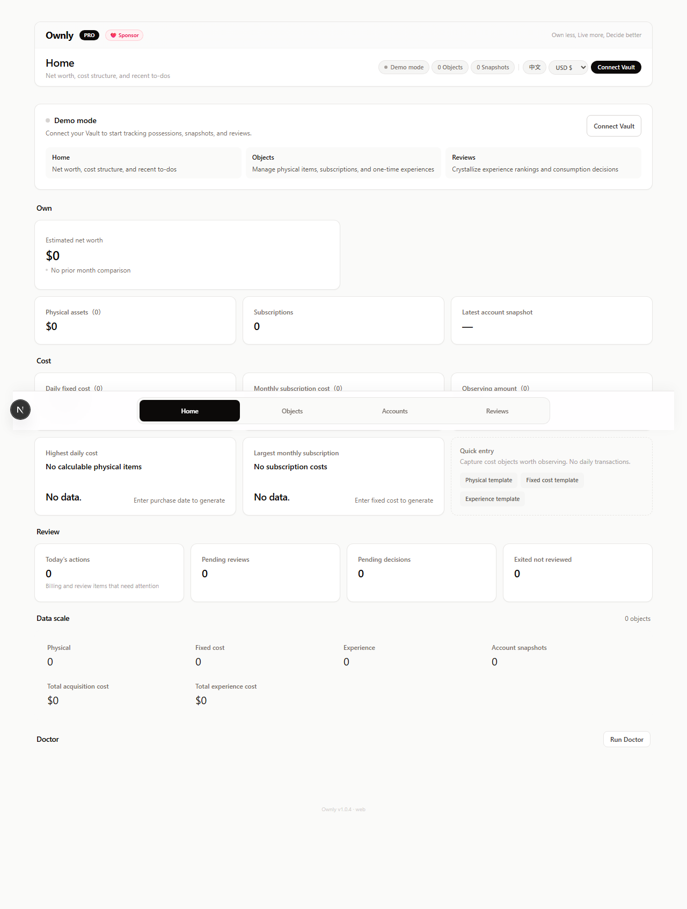
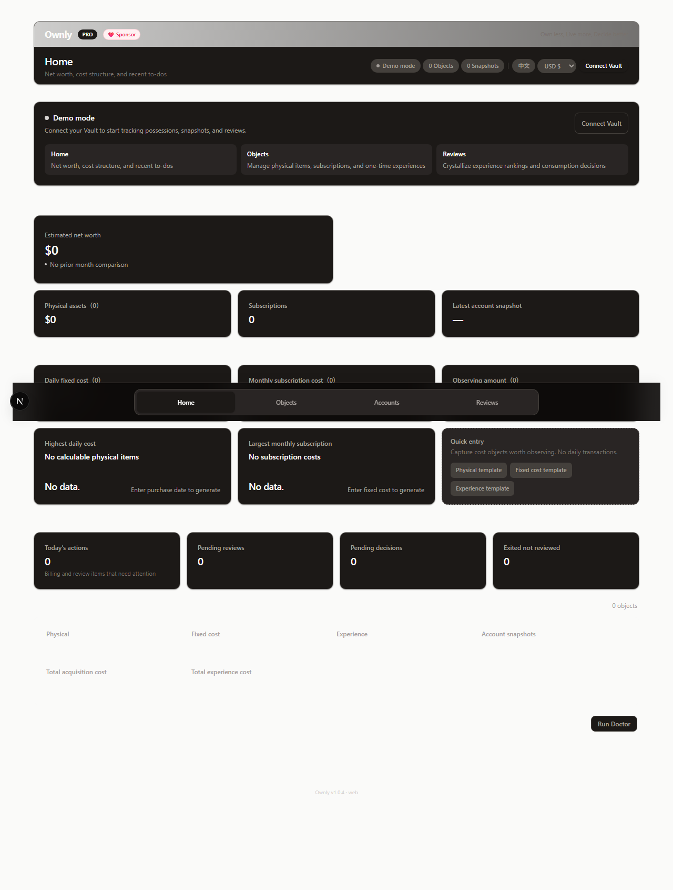

# Ownly

[](https://obsidian.md/plugins?id=ownly)
[](CHANGELOG.md)
[](LICENSE)
[](https://ko-fi.com/F1F7WYJ6B)

> **Own less, Live more, Decide better.**

[中文文档](README.zh.md)

Ownly is a local-first decision ledger for people who want to buy less impulsively, understand what they actually use, and turn past purchases into better future decisions.

- **Obsidian-native**: your Vault is the source of truth.
- **Markdown-first**: every object, snapshot, and review is a plain `.md` file.
- **Decision-focused**: track the full lifecycle from desire to review, not just the amount spent.
- **Private by default**: no cloud account, no telemetry, no personal-data network calls.

<p align="center">
  
  
</p>

## Project Status

Ownly `1.x` is a public Obsidian plugin release; Obsidian is the primary runtime; current validation status is tracked in [docs/QUALITY_BASELINE.md](docs/QUALITY_BASELINE.md). The Web runtime is kept for local browser use, development, and shared-core validation.

| Area | Status |
|---|---|
| Obsidian plugin | Primary runtime; see quality baseline |
| Web runtime | Compatible local runtime |
| Data format | Plain Markdown + YAML frontmatter |
| Storage model | Local Vault / local folder |
| Network model | No personal-data network calls |

## Why Ownly?

Most tracking tools focus on **how much you spend**. Ownly focuses on **whether you should**.

It's not a budgeting app. It's not a wishlist. It's a structured system for making and reviewing consumption decisions:

- **Seed** a desire → **Observe** it over time → **Decide** to buy or pass → **Use** → **Review** after retirement
- Every object has a lifecycle. Every experience gets a review. The data informs your next decision.
- Desires are worth observing before they become purchases.
- Objects only become meaningful when you can see their use, cost, and exit story.
- Reviews turn old consumption into training data for your next decision.

Your data lives as plain Markdown in your Obsidian Vault. You can edit, version-control, or move files freely. Ownly reads and writes frontmatter — it never locks, encrypts, or deletes your data.

## Quick Start

1. **Install** — Open Obsidian → Settings → Community plugins → Browse → search "Ownly" → Install & Enable.
2. **Open** — Click the Ownly icon in the left ribbon or run `Open Ownly workspace` from the command palette.
3. **Explore** — Demo data is auto-seeded on first connect. You'll see sample objects, snapshots, and reviews ready to explore.

## Features

### Object Tracking

Track three types of objects with full lifecycle management:

| Type | Lifecycle |
|---|---|
| **Physical items** | Seeded → Observing → Purchased → Using → Idle → Transferred / Discarded |
| **Subscriptions** | Active → Paused → Cancelled |
| **Experiences** | Planned → In Progress → Completed → Reviewed |

### Financial Tracking

- **Net worth snapshots** — Record asset and liability balances over time with trend charts.
- **Cost analysis** — Daily cost, monthly fixed cost, annual subscription cost, and acquisition cost breakdowns.
- **Payment account aggregation** — See fixed cost pressure by payment account.

### Reviews & Rankings

- Write exit records for physical items and experience reviews.
- Score food, scenery, and experience on a 1-10 scale.
- Rank and compare experiences across categories.

### Travel Insights

- World map with visited countries and cities.
- Travel timeline and statistics.
- Travel-specific experience reviews.

### Data Health

- **Doctor diagnostics** — Local data quality checks: duplicate IDs, schema validation, negative costs, missing references.
- **Archive & restore** — Soft-delete with full recovery. Your Markdown data is never lost.

### More

- **Bilingual UI** — English and Chinese, with auto-detection.
- **Quick entry** — Templates for physical items, subscriptions, and experiences. Paste-line parsing for fast input.
- **Dashboard** — Ownership overview, cost pressure, quick entry, review actions, and data scale.

## Installation

### Obsidian Plugin (Recommended)

Install directly from the Obsidian Community Plugins directory:

👉 **[Install Ownly](https://obsidian.md/plugins?id=ownly)**

### Web Runtime (Local Browser / Developers)

Ownly can also run in a browser and connect to a local folder through the File System Access API. This is useful for trying the shared interface outside Obsidian, local development, and static deployment experiments.

The Obsidian plugin remains the primary runtime. Web support is compatible with the shared Markdown model, but browser file access depends on the user's browser and permissions.

```bash
# Clone and install
git clone https://github.com/liuh886/ownly.git
cd ownly
npm ci

# Development server at localhost:3000
npm run dev

# Or build and serve static export
npm run build
npx pm2 start ecosystem.config.cjs   # serves out/ on port 3000
```

## Data Storage

All data is stored as Markdown files in your Vault under the `Ownly/` directory:

```text
Ownly/
  Objects/         # Physical items, subscriptions, experiences
  Accounts/        # Financial accounts
  Snapshots/       # Net worth snapshots
  Reviews/         # Exit records, experience reviews
  Archive/         # Soft-deleted items (recoverable)
```

Each entity is a standalone `.md` file with YAML frontmatter. You can edit, version-control, or move these files freely.

## Network Calls

Ownly does not make personal-data network calls from the app runtime. All data stays in your Vault. No telemetry, no analytics, no tracking, no license verification.

## Sponsorship Model & Pro Unlock

Ownly is built on a sponsorship model. It does not perform paid license verification or make network calls for activation. Free users always retain full access to their Markdown data — Ownly never locks, encrypts, deletes, or blocks export because of license state.

| Feature | Base | Supporter (Pro) |
|---|---|---|
| Object tracking | ✅ Up to 200 | ✅ Unlimited |
| Net worth snapshots | ✅ Up to 30 | ✅ Unlimited |
| Reviews | ✅ Up to 100 | ✅ Unlimited |
| Travel insights & world map | ❌ | ✅ |
| Doctor diagnostics | ✅ | ✅ |
| Archive & restore | ✅ | ✅ |
| Markdown data export | ✅ Always | ✅ Always |

> **Note:** The current version (1.x) uses a sponsorship model. Pro features can be unlocked with the free activation code shown in the app; supporting via [Ko-fi](https://ko-fi.com/F1F7WYJ6B) or [Gumroad](https://liuh886.gumroad.com/l/ownly) is optional and helps fund development.

## FAQ

**Does Ownly work on mobile?**
The Obsidian plugin is marked as desktop-only (`isDesktopOnly: true`) because it has not been tested on mobile. It may work, but mobile support is not guaranteed.

**What happens to my data if I uninstall Ownly?**
Nothing. Your data is plain Markdown files in your Vault. Uninstalling the plugin does not delete your files. You can read, edit, and move them with any text editor.

**Can I use Ownly without Obsidian?**
Yes. The Web runtime runs in supported desktop browsers and connects to a local folder. See the [Web Runtime installation](#web-runtime-local-browser--developers) section.

## Known Limitations

- The Obsidian plugin is desktop-only.
- Browser folder access depends on File System Access API support.
- The Web runtime focuses on local compatibility and shared-core validation; Obsidian is the primary supported experience.
- Account snapshots work in Web, but full standalone account entity management is more complete in the Obsidian repository adapter.

## Screenshots

<details>
<summary>Click to view screenshots of Objects, Accounts, Reviews, and Doctor pages</summary>

**Objects**
<p align="center">
  
  
</p>

**Accounts**
<p align="center">
  
  
</p>

**Reviews**
<p align="center">
  
  
</p>

</details>

## Support

If Ownly has been useful to you, consider supporting the project:

- [Ko-fi](https://ko-fi.com/F1F7WYJ6B) — One-time donation
- [Gumroad](https://liuh886.gumroad.com/l/ownly) — Optional project sponsorship

## Documentation

- [User Guide](docs/USER_GUIDE.md) — How to use the Home, Objects, Snapshots, and Reviews features.
- [Data Model](docs/DATA_MODEL.md) — Explanation of the Markdown frontmatter schemas and storage structure.
- [Troubleshooting](docs/TROUBLESHOOTING.md) — How to fix corrupted data and use the Doctor tool.
- [Agent CLI Guide](docs/AGENT_CLI_GUIDE.md) — How to programmatically manage your Ownly data using AI agents.
- [Release Checklist](docs/RELEASE_CHECKLIST.md) — Release instructions.

## Developer Documentation

### Validation

```bash
npm run validate           # Full gate: tsc + lint + web build + obsidian validation
npm run validate:obsidian  # Obsidian plugin only
npm run smoke:install      # One-time setup for Python Playwright browser smoke tests
npm run smoke:web          # Starts Next locally and smoke-tests the Web runtime
```

### Ownly CLI

The CLI can be accessed via the legacy alias `wyqd`:

```bash
npm run wyqd -- --vault /path/to/vault object list
```

See [AGENT_CLI_GUIDE.md](docs/AGENT_CLI_GUIDE.md) for full documentation.

### Sample Vault

A repeatable demo fixture is at `samples/wyqd-vault/` (using historical internal naming). Use it for QA and testing.

### Platform-Specific Dependency Reset

`esbuild` ships native binaries. If cross-platform builds fail:

```bash
npm run deps:reset
npm run package:obsidian
```

## Versioning

Ownly follows [Semantic Versioning](https://semver.org/). See [CHANGELOG.md](CHANGELOG.md) for release history.

## License

MIT. See [LICENSE](LICENSE).

## Privacy

See [PRIVACY.md](PRIVACY.md). All data stays local. No telemetry. No cloud sync.
