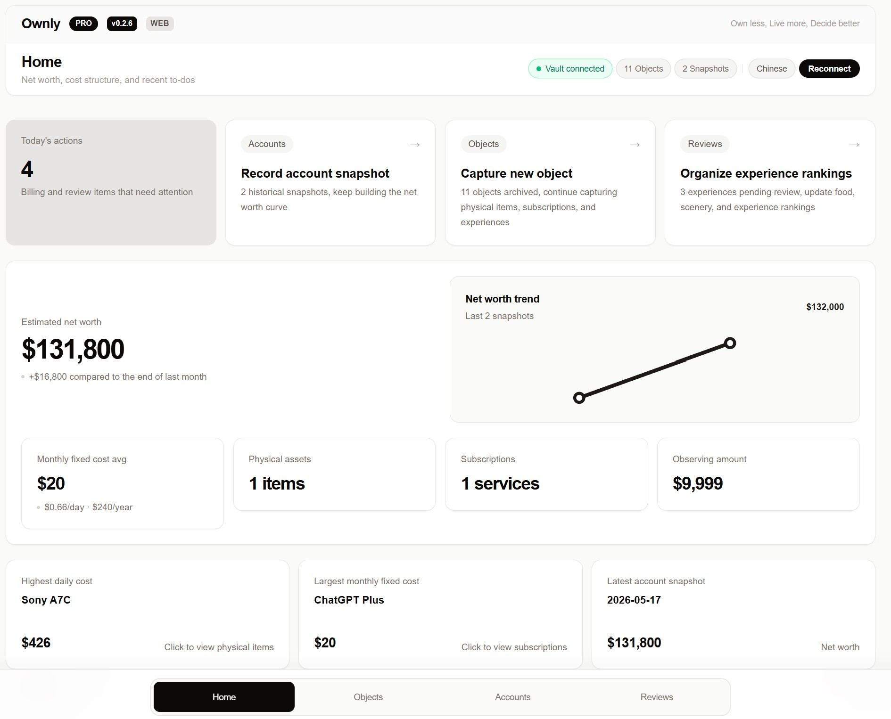

# Ownly

[](https://obsidian.md/plugins?id=ownly)
[](LICENSE)
[](https://ko-fi.com/F1F7WYJ6B)

> **Own less, Live more, Decide better.**

[中文文档](README.zh.md)

Ownly is a local-first decision ledger for tracking possessions, subscriptions, and experiences — built as an Obsidian plugin and a standalone web app. All your data stays in your Vault as plain Markdown files. No cloud, no account, zero network calls.



## Why Ownly?

Most tracking tools focus on **how much you spend**. Ownly focuses on **whether you should**.

It's not a budgeting app. It's not a wishlist. It's a structured system for making and reviewing consumption decisions:

- **Seed** a desire → **Observe** it over time → **Decide** to buy or pass → **Use** → **Review** after retirement
- Every object has a lifecycle. Every experience gets a review. The data informs your next decision.

Your data lives as plain Markdown in your Obsidian Vault. You can edit, version-control, or move files freely. Ownly reads and writes frontmatter — it never locks, encrypts, or deletes your data.

## Quick Start

1. **Install** — Open Obsidian → Settings → Community plugins → Browse → search "Ownly" → Install & Enable.
2. **Open** — Click the Ownly icon in the left ribbon or run `Open Ownly workspace` from the command palette.
3. **Explore** — Demo data is auto-seeded on first connect. You'll see sample objects, snapshots, and reviews ready to explore.

That's it. No account, no configuration, no cloud sync.

## Features

### Object Tracking

Track three types of objects with full lifecycle management:

| Type | Lifecycle |
|---|---|
| **Physical items** | Seeded → Observing → Purchased → Using → Idle → Transferred / Discarded |
| **Subscriptions** | Active → Paused → Cancelled |
| **Experiences** | Planned → In Progress → Completed → Reviewed |

### Financial Tracking

- **Net worth snapshots** — Record asset and liability balances over time with trend charts.
- **Cost analysis** — Daily cost, monthly fixed cost, annual subscription cost, and acquisition cost breakdowns.
- **Payment account aggregation** — See fixed cost pressure by payment account.

### Reviews & Rankings

- Write exit records for physical items and experience reviews.
- Score food, scenery, and experience on a 1-10 scale.
- Rank and compare experiences across categories.

### Travel Insights

- World map with visited countries and cities.
- Travel timeline and statistics.
- Travel-specific experience reviews.

### Data Health

- **Doctor diagnostics** — Local data quality checks: duplicate IDs, schema validation, negative costs, missing references.
- **Archive & restore** — Soft-delete with full recovery. Your Markdown data is never lost.

### More

- **Bilingual UI** — English and Chinese, with auto-detection.
- **Quick entry** — Templates for physical items, subscriptions, and experiences. Paste-line parsing for fast input.
- **Dashboard** — Net worth trends, action center, priority queue, status distribution.

## Installation

### Obsidian Plugin (Recommended)

Install directly from the Obsidian Community Plugins directory:

👉 **[Install Ownly](https://obsidian.md/plugins?id=ownly)**

Or manually in Obsidian:
1. Open Obsidian → Settings → Community plugins → Browse.
2. Search for **Ownly**.
3. Install and enable.

### Web App

The Web App is a separate deployment — it runs in the browser and connects to a local folder via the File System Access API.

```bash
npm run dev        # Development server at localhost:3000
npm run build      # Static export to out/
```

Deploy `out/` to any static hosting (Vercel, Netlify, GitHub Pages) or serve locally:

```bash
npx pm2 start ecosystem.config.cjs
```

The Web App has all features enabled — no license gating.

## Data Storage

All data is stored as Markdown files in your Vault under the `Ownly/` directory:

```text
Ownly/
  Objects/         # Physical items, subscriptions, experiences
  Accounts/        # Financial accounts
  Snapshots/       # Net worth snapshots
  Reviews/         # Exit records, experience reviews
  Archive/         # Soft-deleted items (recoverable)
```

Each entity is a standalone `.md` file with YAML frontmatter. You can edit, version-control, or move these files freely. Ownly reads and writes standard Markdown — no proprietary format, no vendor lock-in.

## Network Calls

Ownly makes **zero network calls**. All data stays in your Vault. No telemetry, no analytics, no tracking, no license verification.

## Free vs Pro

| Feature | Free | Pro |
|---|---|---|
| Object tracking | ✅ Up to 200 | ✅ Unlimited |
| Net worth snapshots | ✅ Up to 30 | ✅ Unlimited |
| Reviews | ✅ Up to 100 | ✅ Unlimited |
| Travel insights & world map | ❌ | ✅ |
| Doctor diagnostics | ✅ | ✅ |
| Archive & restore | ✅ | ✅ |
| Markdown data export | ✅ Always | ✅ Always |

> **Note:** The current version (1.0.0) includes all features for free. Pro tier may be introduced in a future release.

**Pro** is unlocked when you support the project via [Ko-fi](https://ko-fi.com/F1F7WYJ6B) or [Gumroad](https://liuh886.gumroad.com/l/ownly). Free users always retain full access to their Markdown data — Ownly never locks, encrypts, deletes, or blocks export because of license state.

## FAQ

**Does Ownly work on mobile?**
The Obsidian plugin is desktop-only (`isDesktopOnly: true`). The Web App works on any modern browser.

**What happens to my data if I uninstall Ownly?**
Nothing. Your data is plain Markdown files in your Vault. Uninstalling the plugin does not delete your files. You can read, edit, and move them with any text editor.

**Can I use Ownly without Obsidian?**
Yes. The Web App runs in any modern browser and connects to a local folder via the File System Access API. It has all features enabled.

**Does Ownly work offline?**
Yes. Both the Obsidian plugin and Web App are fully offline. No internet connection required.

**How is my data stored?**
Each entity is a standalone `.md` file with YAML frontmatter. No database, no proprietary format. You own your data.

## Support

If Ownly has been useful to you, consider supporting the project:

- [Ko-fi](https://ko-fi.com/F1F7WYJ6B) — One-time donation
- [Gumroad](https://liuh886.gumroad.com/l/ownly) — Support with Pro unlock

## Developer Documentation

### Validation

```bash
npm run validate           # Full gate: tsc + lint + web build + obsidian validation
npm run validate:obsidian  # Obsidian plugin only
```

### Agent CLI

```bash
npm run wyqd -- --vault /path/to/vault object list
```

See [AGENT_CLI_GUIDE.md](docs/AGENT_CLI_GUIDE.md) for full documentation.

### Sample Vault

A repeatable demo fixture is at `samples/wyqd-vault/`. Use it for QA and testing.

### Platform-Specific Dependency Reset

`esbuild` ships native binaries. If cross-platform builds fail:

```bash
npm run deps:reset
npm run package:obsidian
```

## Versioning

Ownly follows [Semantic Versioning](https://semver.org/). See [CHANGELOG.md](CHANGELOG.md) for release history.

## License

MIT. See [LICENSE](LICENSE).

## Privacy

See [PRIVACY.md](PRIVACY.md). All data stays local. No telemetry. No cloud sync.
