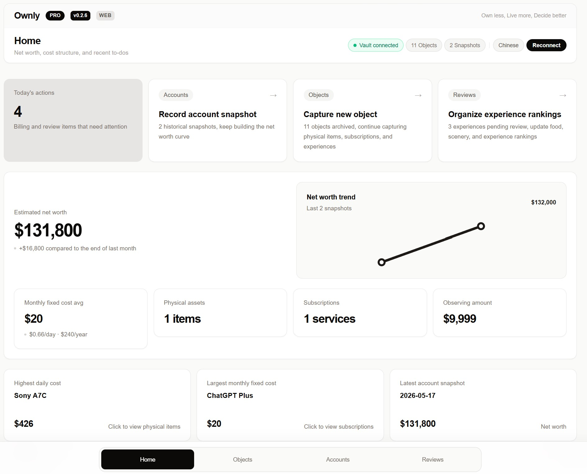

# Ownly

[](https://obsidian.md/plugins?id=ownly)
[](https://liuh886.github.io/ownly/)
[](https://liuh886.github.io/ownly/)
[](CHANGELOG.md)
[](LICENSE)
[](https://ko-fi.com/F1F7WYJ6B)

> **拥有更少，生活更好，决策更优。**

[English](README.md)

**本地优先的所有权记忆系统，为人类和 AI Agent 而建。**

Ownly 帮助你追踪拥有什么、花了多少、用得如何、学到了什么。所有数据都以纯 Markdown 形式存放在本地文件夹中——推荐放在 Obsidian Vault 内，但使用 Web App 或 PWA 本身并不要求安装 Obsidian。

- **Agent 可读的所有权记忆** — 稳定的 CLI 读接口，结构化 JSON 输出，专为 AI Agent 读取和交互设计。
- **纯 Markdown 的个人数据** — 每个物品、快照和复盘都是带有 YAML frontmatter 的 `.md` 文件。无私有格式，无锁定。
- **决策优先的物品生命周期** — 种草、观察、决定、使用、复盘。每个物品通过结构化反思获得意义。
- **人类界面 + Agent CLI** — 在线 Web App、可安装 PWA 与 Obsidian 工作区服务于用户；CLI 用于自动化、脚本和 Agent 集成。



## 选择适合你的使用方式

Ownly 提供两种面向用户的运行时，以及三个便捷入口：

| 使用方式 | 是否需要 Obsidian | 是否需要本地服务器 | 适合场景 |
|---|---:|---:|---|
| **GitHub Pages Web App** | 否 | 否 | 在支持的桌面浏览器中直接打开 Ownly |
| **安装为 PWA** | 否 | 否 | 像桌面应用一样独立运行，并支持离线启动界面 |
| **Obsidian 插件** | 是 | 否 | 深度整合 Vault，在 Obsidian 内直接使用 |

👉 **[通过 GitHub Pages 打开 Ownly](https://liuh886.github.io/ownly/)**

Web App 和 PWA 使用的是同一个本地优先浏览器运行时。它们可以直接连接一个独立的本地 Ownly 数据目录，因此即使不安装 Obsidian，也可以完整使用 Ownly。

**推荐的数据存储方式：** 即使你主要使用 Web App 或 PWA，也建议把 `Ownly/` 数据目录放在 Obsidian Vault 中。这样既能在 Obsidian 中直接阅读、搜索和编辑 Markdown 文件，也能让 Web/PWA 与 Obsidian 插件共享同一套数据，并为未来更换使用界面保留简单、清晰的迁移路径。

## 为 AI Agent 构建

Agent 可以通过稳定的 CLI JSON 命令读取你的本地所有权数据。每条命令都遵循文档化的 JSON 契约——无需界面抓取。

```bash
# 设置 vault 路径
export OWNLY_VAULT=/path/to/vault

# 为 Agent 设计的读取命令
npm run --silent wyqd -- object list --json
npm run --silent wyqd -- object get --id <id> --json
npm run --silent wyqd -- object history --id <id> --json
npm run --silent wyqd -- object review-needed --json
npm run --silent wyqd -- recurring list --active --json
npm run --silent wyqd -- summary --json
```

完整 API 参考、JSON 结构和错误码见 [Agent CLI Contract](docs/AGENT_CLI_CONTRACT.md)。Agent 工作流指导见 [Agent CLI Guide](docs/AGENT_CLI_GUIDE.md)。

## 项目状态

Ownly `1.x` 支持两种面向用户的运行时：Obsidian 插件提供深度 Vault 集成；在线 Web Runtime 托管于 GitHub Pages，并可安装为 PWA。当前验证状态见 [docs/QUALITY_BASELINE.md](docs/QUALITY_BASELINE.md)。

| 领域 | 状态 |
|---|---|
| Obsidian 插件 | 集成式 Vault 运行时 |
| Web Runtime | 托管于 GitHub Pages 的本地优先浏览器运行时 |
| PWA | 可安装的 Web Runtime，支持离线启动应用界面 |
| Agent CLI | 稳定的 JSON 读接口 |
| 数据格式 | 纯 Markdown + YAML frontmatter |
| 存储模型 | 推荐本地 Obsidian Vault；同时支持独立本地文件夹 |

## 为什么选择 Ownly？

大多数追踪工具关注的是**你花了多少钱**。Ownly 关注的是**你是否应该花**。

- **种草**一个欲望 → **观察**一段时间 → **决定**买或不买 → **使用** → 退役后**复盘**
- 每个物品都有生命周期，每次体验都有复盘，数据指导下一次决策
- 数据以纯 Markdown 形式存储在本地文件夹中——推荐放在 Obsidian Vault 内，可自由编辑、版本控制或迁移

## 快速开始

### 方式 A——GitHub Pages Web App

不需要安装 Obsidian。

1. 使用最新版桌面 Chrome 或 Microsoft Edge 打开 **[Ownly Web](https://liuh886.github.io/ownly/)**。
2. 点击 **Connect Vault / 连接 Vault**。
3. 选择以下任一位置：
   - 你的 Obsidian Vault 根目录（**推荐**）；或
   - 一个独立的本地 `Ownly` 数据目录。
4. 在浏览器提示中授权本地文件夹访问。

Web App 是托管在 GitHub Pages 上的纯静态站点。Vault 内容始终保留在你的设备上，不会上传到 GitHub Pages。

### 方式 B——安装为 PWA

PWA 同样不需要安装 Obsidian。

1. 在支持的桌面浏览器中打开 **[Ownly Web](https://liuh886.github.io/ownly/)**。
2. 当页面顶部出现 **Install app / 安装应用** 时点击安装，或使用浏览器自带的安装命令。
3. 从操作系统应用列表、桌面或任务栏启动 Ownly。
4. 连接你在浏览器或 Obsidian 中使用的同一个本地数据目录。

安装后的 PWA 会以独立窗口运行，并缓存应用界面资源，以支持离线启动。你的 Markdown 数据仍然保存在所选择的本地文件夹中，不会被复制进 PWA 缓存。

### 方式 C——Obsidian 插件

1. **安装** — 打开 Obsidian → 设置 → 社区插件 → 浏览 → 搜索 "Ownly" → 安装并启用。
2. **打开** — 点击左侧 Ribbon 的 Ownly 图标，或从命令面板运行 `Open Ownly workspace`。
3. **探索** — 首次连接时自动填充示例物品、快照和复盘记录。

## 功能

### 所有权账本

三种物品类型，完整的生命周期管理：

| 类型 | 生命周期 |
|---|---|
| **实物** | 种草 → 观望 → 购入 → 使用 → 闲置 → 转让 / 丢弃 |
| **订阅** | 活跃 → 暂停 → 取消 |
| **体验** | 计划中 → 进行中 → 已完成 → 已复盘 |

- 快速录入模板和粘贴行解析，快速捕获。
- 成本追踪：购买价格、账单金额、预算 vs 实际、日均成本、年化成本。
- 按支付账户聚合固定成本。

### Agent CLI 读接口

- 所有读取命令提供稳定 JSON 输出：`object list`、`object get`、`object search`、`object history`、`review-needed`、`recurring list`、`summary`。
- 类型特定字段自动暴露：实物的成本字段、订阅的账单字段、旅行体验的位置数据。
- 丰富 Agent 字段：`has_review`、`needs_review`、`review_ref`、源文件路径。
- JSON 错误格式，含文档化错误码（`NOT_FOUND`、`MISSING_OPTION`、`INVALID_INPUT`、`VAULT_NOT_FOUND`）。
- 完整规范见 [Agent CLI Contract](docs/AGENT_CLI_CONTRACT.md)。

### 复盘记忆

- 为实物撰写退役复盘，为体验撰写体验复盘。
- 美食、风景、综合体验 1-10 分评分。
- 跨类别排名对比。
- 复盘通过双向 `review_ref` / `target_id` 关联回物品。

### 本地 Markdown 数据

- 所有数据以 `.md` 文件存储在 `Ownly/Objects`、`Ownly/Reviews`、`Ownly/Snapshots` 下。
- 每个文件是自包含的 YAML frontmatter + Markdown 正文。
- `Ownly/` 数据目录既可以放在 Obsidian Vault 中，也可以作为独立本地文件夹使用。
- 无数据库、无需云端账户、无遥测。

### 数据健康

- **Doctor 诊断** — 本地质量检查：重复 ID、schema 验证、负成本、悬空引用、复盘引用完整性。
- **修复工具** — 预览并修复 `review_ref` 不匹配，文件级确认。
- **归档与恢复** — 软删除，完整恢复。

### 辅助界面

- **仪表盘** — 物品概览、成本压力、快速录入、复盘行动、数据规模。
- **旅行洞察** — 世界地图、到访国家、旅行时间线、统计。
- **排名榜** — 美食、风景、体验评分排名。
- **双语界面** — 中英文自动检测。

## 安装与使用

### Web App 与 PWA——最简单的开始方式

无需安装 Obsidian，无需在本地安装 Ownly，也无需启动本地服务器：

👉 **[打开 Ownly Web](https://liuh886.github.io/ownly/)**

进入在线页面后，当浏览器提供安装提示时，可以点击 **Install app / 安装应用**，把 Ownly 安装为 PWA。

直接连接本地文件夹需要支持 File System Access API 的桌面浏览器。浏览器支持范围、PWA 行为、隐私边界、部署方式和本地开发说明见 [Web Runtime 文档](docs/WEB_RUNTIME.md)。

### Obsidian 插件——最深度的 Vault 集成

从 Obsidian 社区插件目录直接安装：

👉 **[安装 Ownly](https://obsidian.md/plugins?id=ownly)**

对于 Web/PWA 用户，Obsidian 插件不是必需的；但把数据存放在 Obsidian Vault 中仍然是推荐布局。

## 数据存储

推荐布局：

```text
<你的 Obsidian Vault>/
  Ownly/
    Objects/         # 实物、订阅、体验
    Snapshots/       # 净资产快照
    Reviews/         # 退役复盘、体验复盘
    Archive/         # 已归档（可恢复）
```

不使用 Obsidian 时，也可以采用独立布局：

```text
<本地文件夹>/
  Objects/
  Snapshots/
  Reviews/
  Archive/
```

Web App 可以连接 Obsidian Vault 根目录，也可以直接连接独立的 Ownly 数据根目录。

## 赞助

Ownly 免费提供，基础额度宽裕（200 件物品、100 条复盘）。App 中直接展示的免费激活码可解锁无限使用和 Pro 功能。无付费许可联网校验，无激活网络请求。

## 文档

- [用户指南](docs/USER_GUIDE.md) — 核心功能与工作流。
- [Web Runtime](docs/WEB_RUNTIME.md) — GitHub Pages、PWA 安装、浏览器支持、隐私边界和部署方式。
- [Agent CLI Contract](docs/AGENT_CLI_CONTRACT.md) — AI Agent 的稳定 JSON API。
- [Agent CLI Guide](docs/AGENT_CLI_GUIDE.md) — Agent 工作流模式与写入命令。
- [数据模型](docs/DATA_MODEL.md) — Markdown frontmatter 结构。
- [问题排查](docs/TROUBLESHOOTING.md) — Doctor 工具与数据修复。
- [发版流程](docs/RELEASE_CHECKLIST.md) — 发版检查单。
- [Obsidian 审核清单](docs/OBSIDIAN_REVIEWER_CHECKLIST.md) — 插件提交检查单。

## 开发者快速参考

```bash
npm run validate           # 完整验证：tsc + lint + build + obsidian 验证
npm run test               # 单元测试 (vitest)
npm run wyqd -- --vault <path> object list --json
```

## 许可证

MIT。参见 [LICENSE](LICENSE)。所有数据本地存储，无遥测，无强制云同步。